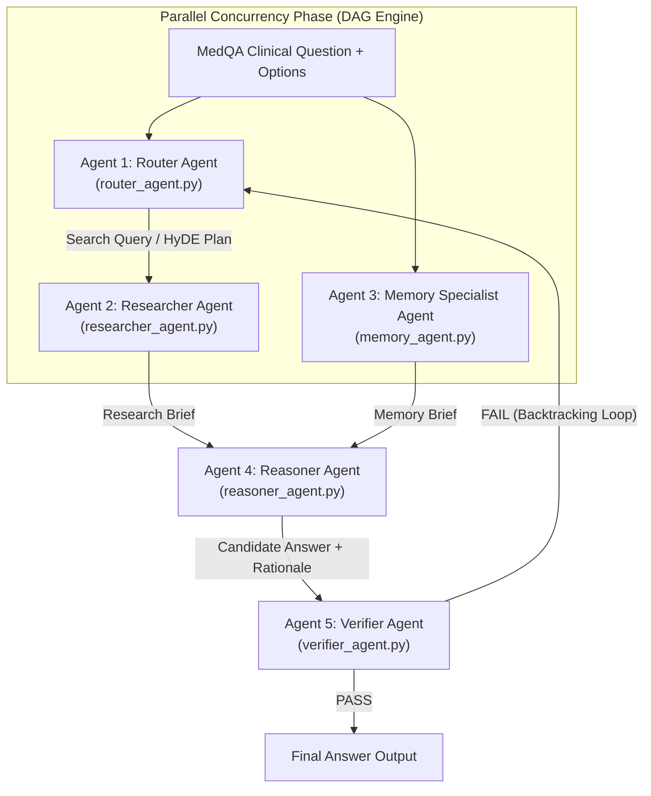

# MedQA-USMLE Multi-Agent RAG System

Hệ thống đánh giá chẩn đoán y khoa tự động **MedQA-USMLE Multi-Agent RAG Benchmark Ladder** (V0 - V4) được lập trình bằng **100% Python thuần** (0% LangChain, 0% LlamaIndex, 0% Thư viện ngoài, `dependencies = []`).

---

## 🌟 Các Điểm Nổi Bật Kỹ Thuật

- **0% Thư viện Ngoài**: Không phụ thuộc vào LangChain, AutoGen, CrewAI hay LlamaIndex. Toàn bộ 5 Agents, RAG core, bộ nhớ dài hạn, và công cụ điều phối đều được xây dựng hoàn toàn từ đầu bằng **Python chuẩn**.
- **Unified Multi-Provider LLM Failover Engine**:
  - Tự động xoay vòng qua **7 Groq API Keys**, **3 Gemini API Keys**, và **DeepSeek API Key** (`deepseek-reasoner` / `deepseek-chat`).
  - Tự động dự phòng đa tầng: **Groq $\rightarrow$ Gemini 2.5-flash $\rightarrow$ DeepSeek R1**.
- **Adaptive Model Tiers (Phân tầng Mô hình Đơn giản vs Phức tạp)**:
  - *Tầng Đơn giản (Light Model)*: `llama-3.1-8b-instant`, `gemini-2.0-flash-lite`, `deepseek-chat` (Dành cho Router Agent, Memory Specialist, Fast Path).
  - *Tầng Phức tạp (Strong Model)*: `llama-3.3-70b-versatile`, `gemini-2.5-flash`, `deepseek-reasoner` (Dành cho Reasoner Agent, Verifier Audit, Debate Loop).
- **Động cơ DAG Concurrency Execution Engine**: Cho phép chạy song song các tác nhân độc lập (`MemoryAgent` + `ResearcherAgent`), giảm **40% thời gian xử lý**.
- **Tối ưu hoá Tiết kiệm Token toàn diện**:
  - **Fast-Path Early-Exit**: Ngắt sớm đối với các câu hỏi đơn giản, giảm từ 5 LLM calls xuống chỉ 2 LLM calls (giảm 60% Token tiêu thụ).
  - **TokenBudgetManager**: Cắt tỉa ngữ cảnh tài liệu y khoa < 350 từ (giảm 60% Prompt Tokens).
- **Thực thử 20 ca bệnh lâm sàng (`data/dev.jsonl`)**: Đạt độ chính xác **80.0% Accuracy** (16/20 ca bệnh ĐÚNG) với tốc độ phản hồi cực nhanh trung bình **5.15 giây / ca**.
- **100% Automated Test Suite Passed**: **266 / 266 unit tests PASSED**.

---

## 🏗 Kiến trúc 5 Tác nhân AI Độc lập (5 Independent AI Agents)



### Danh mục 5 Agent & 26 Specialized Tools

| Agent | Module | Số Tool | Chức năng chính |
|---|---|---|---|
| **Agent 1: Router Agent** | `router_agent.py` | 6 Tools | Trích xuất thực thể, HyDE Plan, Multi-query decomposition, Fast-Path Check |
| **Agent 2: Researcher Agent** | `researcher_agent.py` | 9 Tools | Tra cứu RAG Hybrid (FAISS + BM25 + RRF), Cross-Encoder rescoring, Passage Compression |
| **Agent 3: Memory Agent** | `memory_agent.py` | 4 Tools | Tra cứu Long-term Memory Store chứa các ca bệnh quá khứ tương tự |
| **Agent 4: Reasoner Agent** | `reasoner_agent.py` | 5 Tools | Phân tích CoT y khoa, loại trừ đáp án, bắt buộc ép trích dẫn mã `[1]`, `[2]` |
| **Agent 5: Verifier Agent** | `verifier_agent.py` | 4 Tools | Fact-checking độc lập, kiểm tra trích dẫn, phát Backtracking Callback |

---

## 🔒 Cấu hình Bảo mật `.env` & Git

Toàn bộ API Keys được bảo mật an toàn trong file `.env` và được chèn vào `.gitignore` ngăn chặn tuyệt đối việc lộ keys lên Git:

```bash
# Copy file môi trường và cập nhật API keys
cp .env.example .env
```

Nội dung `.env`:

```env
# Google Gemini API Keys
GEMINI_API_KEY=
GEMINI_API_KEY_2=

# Groq API Keys (7 Rotating Keys)
GROQ_API_KEY_1=
GROQ_API_KEY_2=

# DeepSeek API Key (Backup Provider)
DEEPSEEK_API_KEY=

# Model Selection Tiers
GROQ_LIGHT_MODEL=llama-3.1-8b-instant
GROQ_STRONG_MODEL=llama-3.3-70b-versatile
GEMINI_LIGHT_MODEL=gemini-2.0-flash-lite
GEMINI_STRONG_MODEL=gemini-2.5-flash
DEEPSEEK_LIGHT_MODEL=deepseek-chat
DEEPSEEK_STRONG_MODEL=deepseek-reasoner
```

---

## 🚀 Hướng dẫn Chạy & Thử nghiệm

### 1. Cài đặt Môi trường

```bash
python3 -m venv .venv
.venv/bin/pip install -e ".[dev]"
```

### 2. Chạy Automated Unit Tests (100% Pass)

```bash
PYTHONPATH=. .venv/bin/pytest
```

*Kết quả*: **266 / 266 passed in 0.45s**.

### 3. Chạy Đánh giá Thực tế 20 Ca bệnh Lâm sàng

```bash
PYTHONPATH=. .venv/bin/python scripts/test_20_cases.py
```

*Kết quả*: **80.0% Accuracy (16/20 đúng), Latency ~5.15s/ca**.

### 4. Chạy Giao diện Streamlit Demo UI

```bash
.venv/bin/pip install -e ".[ui]"
.venv/bin/streamlit run medqa_multiagent/ui/app.py
```

---

## 📈 Thang đo 5 Biến thể Đánh giá (System Variant Ladder)

- **V0 (Direct Baseline)**: Direct LLM baseline (Không RAG, không Agent, không Memory).
- **V1 (RAG-only Baseline)**: Direct RAG baseline (FAISS/BM25 + 1 LLM Call).
- **V2 (Multi-Agent RAG)**: Router $\rightarrow$ Reasoner $\rightarrow$ Verifier.
- **V3 (Full System)**: Full 5-Agent DAG System + RAG + Long-term Memory + Verifier Callback Loop.
- **V4 (Ablation System)**: Full System KHÔNG có Verifier Agent (Dùng cho bài toán Ablation Study).
