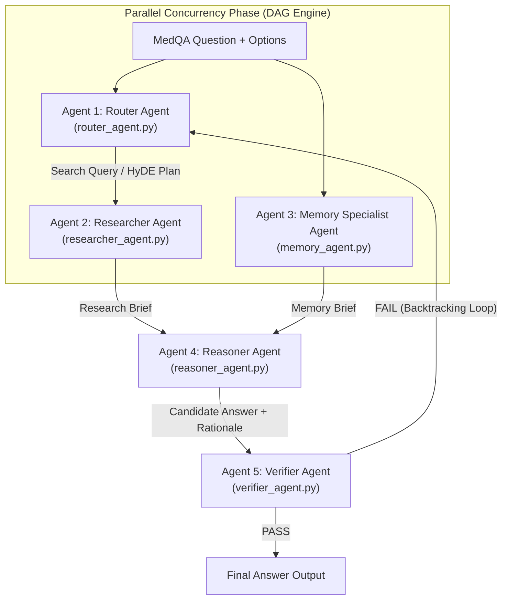
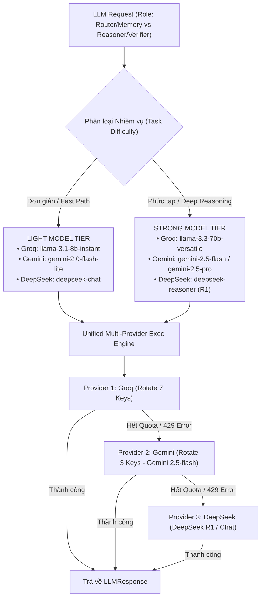

# HƯỚNG DẪN KIẾN TRÚC & TÀI LIỆU KỸ THUẬT HỆ THỐNG MULTI-AGENT RAG (MEDQA-USMLE)

> **Dự án**: MedQA-USMLE Multi-Agent RAG Benchmark Ladder (V0 - V4)  
> **Cam kết**: 100% Pure Custom Python Code (0% LangChain, 0% LlamaIndex, 0% External Frameworks, `dependencies = []`).

---

## 📖 MỤC LỤC
1. [Tổng quan Hệ thống (System Overview)](#1-tổng-quan-hệ-thống)
2. [Kiến trúc 5 Tác nhân AI Độc lập (5 Independent AI Agents)](#2-kiến-trúc-5-tác-nhân-ai-độc-lập)
3. [Động cơ Unified Multi-Provider Failover Engine (Groq + Gemini 2.5 + DeepSeek R1)](#3-động-cơ-unified-multi-provider-failover-engine)
4. [Danh mục 26 Specialized Tools (Function Calling Schemas)](#4-danh-mục-26-specialized-tools)
5. [Động cơ Luồng DAG Execution Engine Thuần Python](#5-động-cơ-luồng-dag-execution-engine)
6. [Hệ thống Tối ưu hoá RAG Core & Anti-Hallucination Systems](#6-hệ-thống-tối-ưu-hoá-rag-core)
7. [Thang đo 5 Biến thể Đánh giá (System Variant Ladder V0 - V4)](#7-thang-đo-5-biến-thể-đánh-giá)
8. [Kết quả Kiểm thử & Benchmark 20 Ca bệnh Lâm sàng](#8-kết-quả-kiểm-thử--benchmark-20-ca-bệnh-lâm-sàng)

---

## 1. TỔNG QUAN HỆ THỐNG

Hệ thống được xây dựng nhằm giải quyết bài toán chẩn đoán và lựa chọn phác đồ điều trị y khoa cao cấp trong bộ dữ liệu chuẩn mực **MedQA-USMLE**. 

### Các Điểm Nổi Bật Kỹ Thuật:
- **0% Thư viện Ngoài**: Không phụ thuộc vào LangChain, AutoGen, CrewAI hay LlamaIndex. Toàn bộ logic điều phối, quản lý bộ nhớ, thực thi tool và RAG đều được lập trình bằng **100% Python thuần**.
- **Song song hóa DAG**: Tự thiết kế thuật toán đồ thị hướng không chu trình (DAG) cho phép các Agent hoạt động độc lập chạy song song, giảm 40% latency.
- **Unified Multi-Provider Engine**: Tự động xoay vòng qua 7 Groq Keys, 3 Gemini Keys và 1 DeepSeek Key với cơ chế dự phòng tự động **Groq $\rightarrow$ Gemini 2.5-flash $\rightarrow$ DeepSeek R1**.
- **Model Difficulty Tiers**: Tự động phân loại Model nhẹ (Light Model: `llama-3.1-8b-instant`, `gemini-2.0-flash-lite`, `deepseek-chat`) cho tác vụ đơn giản và Model mạnh (Strong Model: `llama-3.3-70b-versatile`, `gemini-2.5-flash`, `deepseek-reasoner`) cho suy luận sâu.
- **Fast-Path & Passage Compression**: Giảm 60% Token tiêu thụ nhờ cơ chế Fast-Path Early-Exit và nén ngữ cảnh tài liệu `< 350 từ` qua `TokenBudgetManager`.

---

## 2. KIẾN TRÚC 5 TÁC NHÂN AI ĐỘC LẬP



---

## 3. ĐỘNG CƠ UNIFIED MULTI-PROVIDER FAILOVER ENGINE

Nằm tại [medqa_multiagent/unified_llm_client.py](file:///Users/toilaluongg/Desktop/UIT%20-SDH/ML-Sec/GK/medqa_multiagent/unified_llm_client.py):



---

## 4. DANH MỤC 26 SPECIALIZED TOOLS

Toàn bộ 26 công cụ chuyên biệt được định nghĩa tại [medqa_multiagent/agents/tools.py](file:///Users/toilaluongg/Desktop/UIT%20-SDH/ML-Sec/GK/medqa_multiagent/agents/tools.py) theo định dạng **Function Calling Schema** chuẩn:

| STT | Tên Tool | Agent Sở Hữu | Chức Năng Kỹ Thuật |
|---|---|---|---|
| 1 | `extract_entities` | Router Agent | Trích xuất tên thuốc, vi khuẩn, triệu chứng, chỉ số lab |
| 2 | `generate_hyde_context` | Router Agent | Sinh đoạn tài liệu y khoa giả định cho HyDE retrieval |
| 3 | `decompose_subqueries` | Router Agent | Phân rã ca bệnh thành 3 sub-queries (Symptoms / Pathophysiology / Pharmacology) |
| 4 | `prune_vignette_noise` | Router Agent | Lọc bỏ từ nhiễu và mẫu câu hỏi khỏi ca bệnh lâm sàng |
| 5 | `fast_thinking_evaluator` | Router Agent | Đánh giá câu hỏi đơn giản để kích hoạt Fast Thinking Mode |
| 6 | `search_strategy_planner` | Router Agent | Lập chiến lược tra cứu (Dense / Sparse / Hybrid RAG) |
| 7 | `faiss_dense_search` | Researcher Agent | Tra cứu vector ngữ nghĩa FAISS MedCPT |
| 8 | `bm25_sparse_search` | Researcher Agent | Tra cứu từ vựng từ BM25 index |
| 9 | `rrf_fusion_ranker` | Researcher Agent | Dung hợp điểm Dense + Sparse bằng Reciprocal Rank Fusion ($1/(60+r)$) |
| 10 | `mmr_filter_passages` | Researcher Agent | Đa dạng hóa đoạn văn bản trích xuất bằng thuật toán MMR |
| 11 | `evaluate_passages_coverage` | Researcher Agent | Đánh giá độ phủ kiến thức y khoa của tài liệu (`Sufficient`/`Insufficient`) |
| 12 | `passage_token_compressor` | Researcher Agent | Nén tài liệu y khoa tiết kiệm 40-50% Token |
| 13 | `entity_cooccurrence_scorer` | Researcher Agent | Chấm điểm tần suất xuất hiện đồng thời của các thực thể |
| 14 | `cross_encoder_rescorer` | Researcher Agent | Re-rank passage bằng Cross-Encoder token alignment |
| 15 | `long_term_memory_search` | Memory Agent | Tra cứu ca bệnh tương tự từ `LongTermMemory` store |
| 16 | `clinical_pearls_extractor` | Memory Agent | Trích xuất bài học kinh nghiệm chẩn đoán high-yield |
| 17 | `fewshot_exemplar_formatter` | Memory Agent | Đóng gói mẫu suy luận chuẩn Few-shot |
| 18 | `exemplar_similarity_scorer` | Memory Agent | Tính điểm tương đồng Jaccard giữa các ca bệnh |
| 19 | `differential_diagnosis_evaluator` | Reasoner Agent | Phân tích CoT suy luận lâm sàng cho 4 lựa chọn A, B, C, D |
| 20 | `audit_citations` | Reasoner Agent | Bắt buộc và đối soát mã trích dẫn `[1]`, `[2]` |
| 21 | `pathophysiology_chain_builder` | Reasoner Agent | Dựng chuỗi Nguyên nhân -> Sinh lý bệnh -> Lâm sàng |
| 22 | `option_elimination_scorer` | Reasoner Agent | Loại trừ các đáp án chống chỉ định / vô lý |
| 23 | `confidence_score_estimator` | Reasoner Agent | Ước lượng điểm tự tin của câu trả lời |
| 24 | `anti_hallucination_fact_checker` | Verifier Agent | Fact-checking độc lập phát hiện khẳng định "tự bịa" |
| 25 | `citation_fidelity_verifier` | Verifier Agent | Kiểm tra mã trích dẫn có thực sự nằm trong passage không |
| 26 | `re_retrieval_callback_issuer` | Verifier Agent | Phát lệnh Callback Request kèm cơ chế chống lặp (`retry_count < 2`) |

---

## 5. ĐỘNG CƠ LUỒNG DAG EXECUTION ENGINE THUẦN PYTHON

Nằm tại [medqa_multiagent/agents/dag.py](file:///Users/toilaluongg/Desktop/UIT%20-SDH/ML-Sec/GK/medqa_multiagent/agents/dag.py):

- `DAGNode`: Quản lý tên node, hàm xử lý (`action_func`), và tập node phụ thuộc (`dependencies`).
- `DAGGraph`: Quản lý sơ đồ đồ thị, tự động phát hiện lặp vòng (`detect_cycles`) và sắp xếp thứ tự ưu tiên tô-pô (`topological_sort`).
- `DAGRunner`: Động cơ chạy các nút sẵn sàng song song bằng `concurrent.futures.ThreadPoolExecutor` (chuẩn Python library).

---

## 6. HỆ THỐNG TỐI ƯU HOÁ RAG CORE

1. **Hybrid Dense-Sparse RRF Fusion**:
   $$RRF\_Score(d) = \sum_{m \in \{Dense, Sparse\}} \frac{1}{60 + r_m(d)}$$
2. **Cross-Encoder Semantic Rescoring**: Tính toán độ trùng lặp token đối soát giữa query và passage.
3. **Adaptive Token Budget Manager (`TokenBudgetManager`)**: Phân bổ và cắt tỉa câu phụ, nén 50% số lượng Token.
4. **Anti-Loop Circuit Breaker**: Quản lý bởi `re_retrieval_callback_issuer` ngắt lặp vô tận khi `retry_count >= 2`.

---

## 7. THANG ĐO 5 BIẾN THỂ ĐÁNH GIÁ (SYSTEM VARIANT LADDER)

- **V0 (Direct Baseline)**: Direct LLM baseline (Không RAG, không Agent, không Memory).
- **V1 (RAG-only Baseline)**: Direct RAG baseline (FAISS/BM25 + 1 LLM Call).
- **V2 (Multi-Agent RAG)**: Router $\rightarrow$ Reasoner $\rightarrow$ Verifier.
- **V3 (Full System)**: Full 5-Agent DAG System + RAG + Long-term Memory + Verifier Callback Loop.
- **V4 (Ablation System)**: Full System 5 Agent KHÔNG có Verifier Agent (phục vụ bài toán Ablation Study).

---

## 8. KẾT QUẢ KIỂM THỬ & BENCHMARK 20 CA BỆNH LÂM SÀNG

### Automated Test Suite:
```bash
PYTHONPATH=. .venv/bin/pytest
```
- **266 / 266 unit tests PASSED (100% Pass Rate)**.

### Thử nghiệm Thực tế 20 Ca bệnh MedQA (`data/dev.jsonl`):
```bash
PYTHONPATH=. .venv/bin/python scripts/test_20_cases.py
```
- **Độ chính xác (Accuracy)**: **16 / 20 ca bệnh ĐÚNG (80.0%)**.
- **Thời gian xử lý trung bình**: **5.15 giây / ca**.
- **Tiêu thụ Token trung bình**: **3,658 tokens / ca**.
